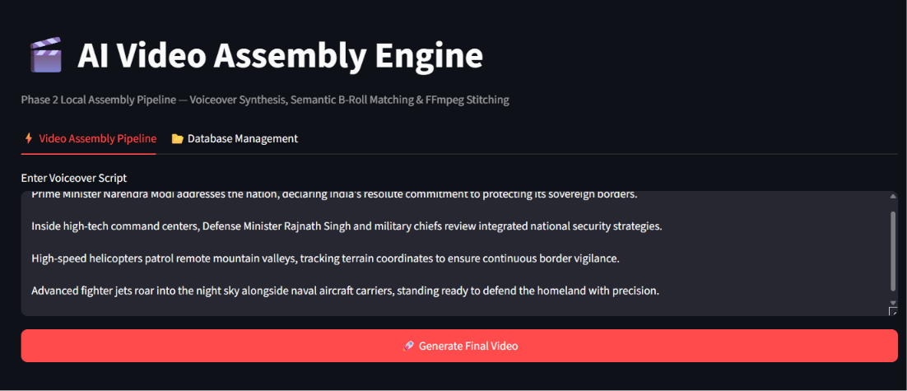
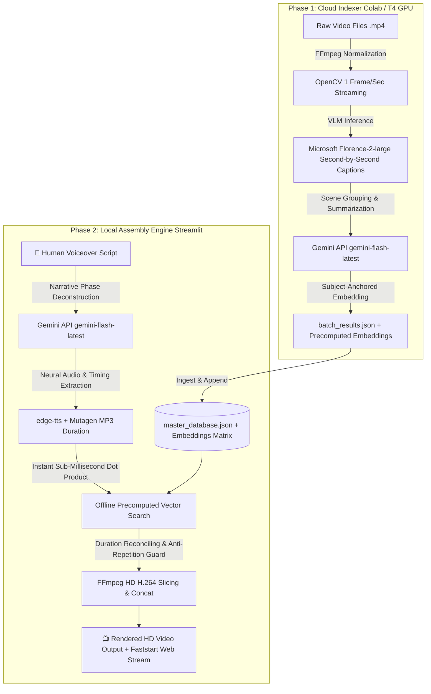

https://github.com/user-attachments/assets/34cf771a-ce29-4952-b53a-7e1a6962c085

# 🎬 AI Video Assembly Engine
**An End-to-End Automated Video Production Pipeline combining Cloud VLM Indexing (Florence-2 & Gemini Flash Latest) with Local High-Precision Assembly (edge-tts, Precomputed Vector Search & FFmpeg).**

---

## 🌟 Executive Overview
The **AI Video Assembly Engine** is a two-phase mono-repository designed to transform raw unorganized video footage into fully produced, narrated HD videos automatically from text scripts.

1. **Phase 1 (`phase1_colab`): The Cloud Indexer** runs on GPU cloud notebooks (Google Colab T4). It streams raw video frame-by-frame, generates dense visual descriptions using **Microsoft Florence-2-large**, groups contiguous scenes via **Google Gemini (`gemini-flash-latest`)**, and precomputes semantic vector embeddings during ingestion.
2. **Phase 2 (`phase2_local`): The Local Assembly Engine** runs locally via **Streamlit**. It deconstructs human scripts into narrative phases using **Google Gemini (`gemini-flash-latest`)**, synthesizes realistic voiceovers via **edge-tts**, matches scenes instantly using **Precomputed Offline Vector Search**, and stitches a polished `1280x720 @ 30fps` MP4 production using **FFmpeg**.

---

## 📸 Demo Showcase & Streamlit Frontend

### 🖥️ Streamlit Interactive UI (Phase 2)
*(Place your Streamlit frontend screenshot in `assets/streamlit_frontend.png`)*
```markdown

```

### 🎞️ Generated Output Video Demo
*(Place your generated output MP4 or GIF in `assets/demo_output.mp4`)*
```markdown

```

---

## 🏗️ End-to-End System Architecture



---

## 📦 Phase 1 Output Schema (`batch_results.json`)

Phase 1 processes uploaded videos and generates a structured JSON array (`batch_results.json`). Each entry defines a semantic scene block with precise start/end timestamps and descriptive metadata:

```json
[
  {
    "video_source": "videoplayback (29).mp4",
    "start_time": "00:00:02",
    "end_time": "00:00:04",
    "duration_seconds": 3.0,
    "main_object": "soldiers",
    "clip_description": "A group of Indian Army soldiers march down a street in uniform, carrying guns and holding the Indian flag under a clear blue sky.",
    "embedding": [0.0245, -0.1183, 0.0531, 0.0892, "...", -0.0412]
  }
]
```

---

## ✨ Detailed Workflow & Features

### Phase 1: The Cloud Indexer (`phase1_colab`)
* **Video Standardization Pipeline:** Normalizes incoming `.mp4` containers (`1280x720 @ 30fps H.264`) via FFmpeg before inference.
* **Parallel VLM Streaming (`Florence-2-large`):** Extracts frames at 1 frame/second directly in memory (`cv2.VideoCapture`) without saving images to disk, generating granular second-by-second visual captions using `microsoft/Florence-2-large`.
* **Scene Stitching & Object Extraction (`gemini-flash-latest`):** Groups contiguous seconds where visual context remains identical into cohesive clip entries containing `start_time`, `end_time`, `duration_seconds`, `clip_description`, and `main_object`.
* **Precomputed Vector Indexing:** Computes composite semantic embeddings at ingestion time so local retrieval requires zero live database encoding.

### Phase 2: The Local Assembly Engine (`phase2_local`)
* **Database Management Automation:** Drag-and-drop JSON uploader appending new batch results directly into `master_database.json`.
* **Contextual Script Splitting (`gemini-flash-latest`):** Intelligently splits narrative scripts into sequential visual phases matched to scene transitions.
* **Async Audio Synthesis (`edge-tts`):** Generates studio-grade voiceovers asynchronously across customizable neural voices (`en-US-ChristopherNeural`, etc.) and extracts precise target cut durations down to the millisecond (`mutagen.mp3.MP3`).
* **Precomputed Offline Vector Search:** Performs instant sub-millisecond cosine similarity matrix lookups against stored database vectors, eliminating runtime embedding bottlenecks.
* **Duration Reconciling & Anti-Repetition Guard:** Dynamically chains non-adjacent clips when audio duration exceeds single clip duration ($A_d > V_d$) while maintaining a runtime `used_clips` registry to prevent repetitive B-roll.
* **Normalized HD Stitching (`FFmpeg`):** Re-encodes clips onto a clean `1280x720` H.264/AAC canvas with `-movflags +faststart` for instant web streaming.

---

## 📂 Repository Structure

```text
Video_maker/
├── README.md                              # System documentation & architecture
├── .gitignore                             # Ignored API keys & local video assets
├── phase1_colab/                          # Cloud GPU indexing environment
│   ├── indexer.ipynb                      # Colab notebook for Florence-2 + Gemini indexing
│   ├── batch_results.json                 # Sample output schema from Phase 1
│   └── blueprint.md                       # Full technical blueprint
└── phase2_local/                          # Local desktop assembly interface
    ├── app.py                             # Interactive Streamlit assembly application
    ├── requirements.txt                   # Local Python dependencies
    ├── .env.example                       # API key template (copy to .env)
    ├── master_database.json               # Persistent local video database
    ├── raw_assets/                        # Local raw video library (.gitkeep)
    └── temp_build/                        # Intermediate audio/video build cache (.gitkeep)
```

---

## 🚀 Quickstart Guide

### 1. Running Phase 1 (Cloud Indexing)
1. Open `phase1_colab/indexer.ipynb` in **Google Colab** with a **T4 GPU** runtime enabled.
2. Upload your raw video files into Colab and execute the pipeline to generate `batch_results.json` along with precomputed embeddings.
3. Download `batch_results.json` to your local machine.

### 2. Running Phase 2 (Local Video Assembly)

#### A. Clone & Install Dependencies
```bash
git clone https://github.com/yourusername/Video_maker.git
cd Video_maker/phase2_local
pip install -r requirements.txt
```

#### B. Install System FFmpeg
Ensure `ffmpeg` is installed and available in your system PATH:
* **Windows (WinGet):** `winget install Gyan.FFmpeg`
* **macOS (Homebrew):** `brew install ffmpeg`
* **Linux (Ubuntu/Debian):** `sudo apt install ffmpeg`

#### C. Configure API Credentials
Copy `.env.example` to `.env` inside `phase2_local/` and insert your Gemini API key:
```ini
GEMINI_API_KEY=your_actual_gemini_api_key_here
```

#### D. Populate Video Assets & Database
1. Place your source `.mp4` video files into `phase2_local/raw_assets/`.
2. Launch the Streamlit application:
```bash
streamlit run app.py
```
3. Open the **Database Management** tab to import your `batch_results.json`.
4. Switch to the **Video Assembly Pipeline** tab, enter your voiceover script, and click **Generate Final Video**!
